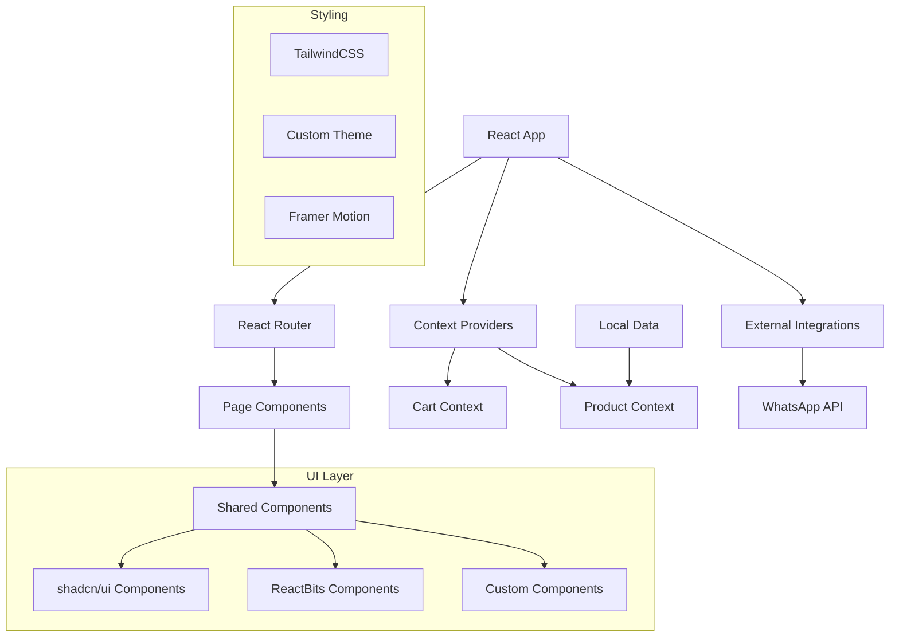

# Design Document

## Overview

The premium chocolate eCommerce website is a React-based single-page application that provides an elegant shopping experience with WhatsApp integration for checkout. The application uses modern React patterns with Context API for state management, React Router for navigation, and a premium design system built with TailwindCSS and shadcn/ui components.

## Architecture

### High-Level Architecture



### Technology Stack

- **Frontend Framework**: React 18 with Vite for fast development and building
- **Routing**: React Router DOM v6 for client-side navigation
- **State Management**: React Context API with useReducer for complex state
- **Styling**: TailwindCSS with custom theme configuration
- **UI Components**: shadcn/ui and ReactBits for consistent design system
- **Icons**: Lucide React for consistent iconography
- **Animations**: Framer Motion for smooth transitions and micro-interactions
- **Data Storage**: Local JSON file with Context API for runtime management

## Components and Interfaces

### Core Components Structure

```
src/
├── components/
│   ├── ui/                    # shadcn/ui base components
│   ├── layout/
│   │   ├── Navbar.jsx         # Navigation with cart indicator
│   │   └── Footer.jsx         # Site footer with links
│   ├── product/
│   │   ├── ProductCard.jsx    # Product display card
│   │   ├── ProductModal.jsx   # Product detail modal
│   │   └── ProductGrid.jsx    # Product listing grid
│   ├── cart/
│   │   ├── CartItem.jsx       # Individual cart item
│   │   ├── CartSummary.jsx    # Cart totals and checkout
│   │   └── CartIcon.jsx       # Floating cart indicator
│   └── admin/
│       ├── AdminForm.jsx      # Product management form
│       └── ProductList.jsx    # Admin product listing
├── pages/
│   ├── Home.jsx               # Landing page with hero
│   ├── Products.jsx           # Product catalog page
│   ├── Cart.jsx               # Shopping cart page
│   ├── Admin.jsx              # Admin panel page
│   └── About.jsx              # Brand information page
├── context/
│   ├── CartContext.jsx        # Cart state management
│   └── ProductContext.jsx     # Product data management
├── hooks/
│   ├── useCart.jsx            # Cart operations hook
│   ├── useProducts.jsx        # Product operations hook
│   └── useWhatsApp.jsx        # WhatsApp integration hook
├── utils/
│   ├── whatsapp.js            # WhatsApp URL generation
│   ├── currency.js            # Price formatting utilities
│   └── validation.js          # Form validation helpers
└── data/
    └── products.js            # Initial product data
```

### Component Interfaces

#### ProductCard Component
```javascript
interface ProductCardProps {
  product: {
    id: number;
    name: string;
    price: number;
    description: string;
    image: string;
  };
  onAddToCart: (product) => void;
  onBuyNow: (product) => void;
}
```

#### CartItem Component
```javascript
interface CartItemProps {
  item: {
    id: number;
    product: Product;
    quantity: number;
  };
  onUpdateQuantity: (id: number, quantity: number) => void;
  onRemove: (id: number) => void;
}
```

#### AdminForm Component
```javascript
interface AdminFormProps {
  product?: Product;
  onSubmit: (productData) => void;
  onCancel?: () => void;
  mode: 'create' | 'edit';
}
```

## Data Models

### Product Model
```javascript
const Product = {
  id: number,           // Unique identifier
  name: string,         // Product name (max 100 chars)
  price: number,        // Price in rupees (positive integer)
  description: string,  // Product description (max 500 chars)
  image: string,        // Image URL or path
  category?: string,    // Optional product category
  inStock: boolean,     // Availability status
  createdAt: Date,      // Creation timestamp
  updatedAt: Date       // Last update timestamp
}
```

### Cart Item Model
```javascript
const CartItem = {
  id: string,           // Unique cart item ID
  productId: number,    // Reference to product
  product: Product,     // Full product object
  quantity: number,     // Item quantity (min 1, max 99)
  addedAt: Date        // When item was added to cart
}
```

### Cart State Model
```javascript
const CartState = {
  items: CartItem[],    // Array of cart items
  totalItems: number,   // Total quantity of all items
  totalPrice: number,   // Total price of all items
  isOpen: boolean      // Cart modal/drawer state
}
```

## Context Architecture

### CartContext Design
```javascript
const CartContext = {
  // State
  state: CartState,
  
  // Actions
  addToCart: (product: Product, quantity?: number) => void,
  removeFromCart: (itemId: string) => void,
  updateQuantity: (itemId: string, quantity: number) => void,
  clearCart: () => void,
  toggleCart: () => void,
  
  // Computed values
  getCartTotal: () => number,
  getCartItemCount: () => number,
  isInCart: (productId: number) => boolean
}
```

### ProductContext Design
```javascript
const ProductContext = {
  // State
  products: Product[],
  loading: boolean,
  error: string | null,
  
  // Actions
  addProduct: (productData: Omit<Product, 'id'>) => void,
  updateProduct: (id: number, productData: Partial<Product>) => void,
  deleteProduct: (id: number) => void,
  getProduct: (id: number) => Product | undefined,
  
  // Filters and search
  searchProducts: (query: string) => Product[],
  filterByCategory: (category: string) => Product[]
}
```

## WhatsApp Integration Design

### Message Formatting
```javascript
// Single product purchase
const singleProductMessage = `Hello, I'd like to order:
Product: ${product.name}
Price: ₹${product.price}
Quantity: 1`;

// Cart checkout message
const cartCheckoutMessage = `Hello, I'd like to order the following chocolates:
${cartItems.map((item, index) => 
  `${index + 1}. ${item.product.name} - ${item.quantity} x ₹${item.product.price}`
).join('\n')}

Total: ₹${totalAmount}`;
```

### URL Generation
```javascript
const generateWhatsAppURL = (message, phoneNumber = '919895905758') => {
  const encodedMessage = encodeURIComponent(message);
  return `https://wa.me/${phoneNumber}?text=${encodedMessage}`;
};
```

## Design System

### Color Palette
```css
:root {
  --color-primary: #2B1D0E;      /* Rich dark chocolate brown */
  --color-accent: #D4AF37;       /* Gold */
  --color-secondary: #F8F1E5;    /* Cream */
  --color-text-primary: #2B1D0E;
  --color-text-secondary: #6B5B47;
  --color-background: #FFFFFF;
  --color-surface: #F8F1E5;
}
```

### Typography Scale
```css
/* Headings - Serif (Playfair Display) */
.heading-xl { font-size: 3.5rem; line-height: 1.1; }
.heading-lg { font-size: 2.5rem; line-height: 1.2; }
.heading-md { font-size: 2rem; line-height: 1.3; }
.heading-sm { font-size: 1.5rem; line-height: 1.4; }

/* Body - Sans-serif (Inter) */
.body-lg { font-size: 1.125rem; line-height: 1.6; }
.body-md { font-size: 1rem; line-height: 1.6; }
.body-sm { font-size: 0.875rem; line-height: 1.5; }
```

### Component Variants
```javascript
// Button variants
const buttonVariants = {
  primary: "bg-accent text-primary hover:bg-accent/90",
  secondary: "bg-secondary text-primary hover:bg-secondary/90",
  outline: "border-2 border-accent text-accent hover:bg-accent hover:text-primary"
};

// Card variants
const cardVariants = {
  product: "bg-white shadow-lg hover:shadow-xl transition-shadow",
  elevated: "bg-white shadow-xl border border-secondary/20"
};
```

## Responsive Design Strategy

### Breakpoint System
```css
/* Mobile First Approach */
.container {
  @apply px-4;
}

@media (min-width: 640px) {  /* sm */
  .container { @apply px-6; }
}

@media (min-width: 768px) {  /* md */
  .container { @apply px-8; }
}

@media (min-width: 1024px) { /* lg */
  .container { @apply px-12; }
}

@media (min-width: 1280px) { /* xl */
  .container { @apply px-16; }
}
```

### Grid Layouts
```css
/* Product Grid Responsive */
.product-grid {
  @apply grid gap-6;
  @apply grid-cols-1;           /* Mobile: 1 column */
  @apply sm:grid-cols-2;        /* Small: 2 columns */
  @apply lg:grid-cols-3;        /* Large: 3 columns */
  @apply xl:grid-cols-4;        /* XL: 4 columns */
}
```

## Animation and Interaction Design

### Micro-interactions
```javascript
// Framer Motion variants
const cardVariants = {
  initial: { scale: 1, boxShadow: "0 4px 6px -1px rgba(0, 0, 0, 0.1)" },
  hover: { 
    scale: 1.02, 
    boxShadow: "0 20px 25px -5px rgba(0, 0, 0, 0.1)",
    transition: { duration: 0.2 }
  }
};

const fadeInVariants = {
  initial: { opacity: 0, y: 20 },
  animate: { opacity: 1, y: 0, transition: { duration: 0.5 } }
};
```

### Page Transitions
```javascript
const pageVariants = {
  initial: { opacity: 0, x: -20 },
  in: { opacity: 1, x: 0 },
  out: { opacity: 0, x: 20 }
};

const pageTransition = {
  type: "tween",
  ease: "anticipate",
  duration: 0.4
};
```

## Error Handling

### Error Boundaries
```javascript
class ProductErrorBoundary extends React.Component {
  constructor(props) {
    super(props);
    this.state = { hasError: false, error: null };
  }

  static getDerivedStateFromError(error) {
    return { hasError: true, error };
  }

  render() {
    if (this.state.hasError) {
      return <ErrorFallback error={this.state.error} />;
    }
    return this.props.children;
  }
}
```

### Error States
- **Product Loading Error**: Display retry button with error message
- **Cart Operation Error**: Show toast notification with error details
- **WhatsApp Integration Error**: Fallback to manual contact information
- **Image Loading Error**: Display placeholder image with product name
- **Form Validation Error**: Inline error messages with field highlighting

## Testing Strategy

### Unit Testing Approach
- **Components**: Test rendering, props handling, and user interactions
- **Context**: Test state updates and action dispatching
- **Utilities**: Test WhatsApp URL generation and currency formatting
- **Hooks**: Test custom hook behavior and side effects

### Integration Testing
- **User Flows**: Test complete shopping journey from browse to checkout
- **Context Integration**: Test component interaction with context providers
- **Router Integration**: Test navigation and route parameter handling

### Testing Tools
- **Jest**: Unit test runner and assertion library
- **React Testing Library**: Component testing utilities
- **MSW**: Mock Service Worker for API mocking (if needed for future backend)
- **Cypress**: End-to-end testing for critical user paths

### Test Coverage Goals
- **Components**: 80% coverage minimum
- **Business Logic**: 90% coverage minimum
- **Critical Paths**: 100% coverage (cart operations, checkout flow)

## Performance Considerations

### Code Splitting
```javascript
// Lazy load pages
const Home = lazy(() => import('./pages/Home'));
const Products = lazy(() => import('./pages/Products'));
const Cart = lazy(() => import('./pages/Cart'));
const Admin = lazy(() => import('./pages/Admin'));
const About = lazy(() => import('./pages/About'));
```

### Image Optimization
- Use WebP format with JPEG fallback
- Implement lazy loading for product images
- Provide multiple image sizes for responsive design
- Use placeholder images during loading

### Bundle Optimization
- Tree shake unused dependencies
- Use dynamic imports for heavy libraries
- Minimize TailwindCSS output with purge configuration
- Optimize Framer Motion imports

## Security Considerations

### Input Validation
- Sanitize all user inputs in admin forms
- Validate product data structure and types
- Implement client-side validation with server-side mindset
- Prevent XSS through proper escaping

### Data Protection
- No sensitive data storage in localStorage
- Secure WhatsApp URL generation
- Validate all external URLs before redirection
- Implement proper error handling without exposing internals